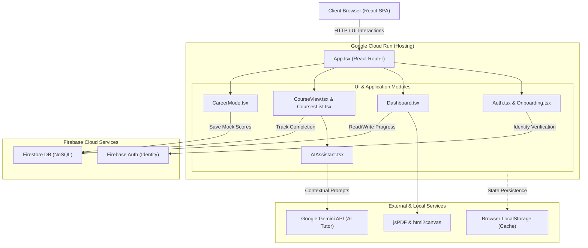

<div align="center">

# 🎓 SkillVerse

## Advanced E-Learning Platform

*A modern, feature-rich E-learning platform designed to deliver a personalized, engaging, and career-focused learning experience.*


</div>

---

# 📖 Overview

SkillVerse combines structured learning, real interview preparation, gamification, analytics, certifications, and beautiful UX to simulate a **real SaaS product**, not just a demo app.

It is built to demonstrate **real-world product thinking**, combining UX psychology, frontend architecture, user engagement strategies, and career-oriented learning. This project goes beyond tutorials and focuses on **how modern learning platforms are actually designed**.

---

# ✨ Features

- 🎯 **Smart Onboarding**: Animated question flow to personalize your learning path.
- 📚 **Structured Courses**: Real learning resources, quizzes, and tracking.
- 💼 **Career Mode**: Company-wise interview questions, mock interviews, and career readiness scores.
- 🎮 **Gamification**: XP system, levels, streaks, achievement badges, and celebration animations.
- 🧠 **Learning Analytics**: Progress visualization, strength/weakness insights, and consistency tracking.
- 🎓 **Professional Certificates**: Auto-generated, beautifully designed, and downloadable PDF certificates.
- ⚙️ **Customizable Settings**: Profile management, learning preferences, and appearance customization.
- 🌙 **Premium UI**: Dark mode first, soft gradients, glassmorphism, and smooth micro-interactions.
- 🎥 **Product Tour**: Auto-play guided walkthrough for new users.

---

# 🏗 Architecture



---

# 🤖 Core Modules

### 🔐 Production-Grade Authentication

Replaced basic local storage with a highly secure, scalable **Firebase Authentication** system:

- Supports Email/Password, Google, and GitHub Sign In.
- Strict password validation (12+ chars, special chars, no dictionary passwords).
- Verification Wall (requires email verification before dashboard access).
- Firestore integration for user document creation and last-login tracking.

### 📚 Learning System

Categorized subjects (Programming, DSA, Design) containing structured notes, real resources, and integrated quizzes for progress tracking.

### 💼 Career Mode

Features 20 tech companies with at least 10 real interview questions per company. Includes difficulty tags, topic labels, trusted external resources, and a mock interview mode.

### 🎮 Gamification & XP

Motivation-driven UX featuring an XP system for learning and practice, levels, streaks, achievement badges, and beautiful celebration animations.

### 🎓 Certification System

Generates professional certificates upon course completion. Features a user-friendly preview and allows users to download their certificate as a PDF using `html2canvas` and `jsPDF`.

---

# 🛠 Tech Stack

| Category | Technology |
| -------- | ---------- |
| **Frontend Framework** | React |
| **Language** | TypeScript |
| **Styling** | Tailwind CSS |
| **Animations** | Framer Motion |
| **Routing** | React Router |
| **Authentication** | Firebase Auth |
| **Database** | Firestore |
| **Certificate Generation** | html2canvas & jsPDF |
| **Hosting** | Vercel |
| **Build Tool** | Vite |
| **Version Control** | Git & GitHub |

---

# 📸 Screenshots

## Landing Page


---

## Dashboard


---

## Courses


---

## Career Mode


---

## Certifications


---

## Settings


---

# ⚙️ Installation & Setup

## 1. Clone the repository

```bash
git clone https://github.com/Khushi1310-nayak/SkillVerse.git
cd SkillVerse
```

## 2. Install dependencies

```bash
npm install
```

## 3. Configure environment variables

Copy the example environment file:

```bash
cp .env.example .env
```

Fill in the following Firebase credentials from your Firebase project:

- `VITE_FIREBASE_API_KEY`
- `VITE_FIREBASE_AUTH_DOMAIN`
- `VITE_FIREBASE_PROJECT_ID`
- `VITE_FIREBASE_STORAGE_BUCKET`
- `VITE_FIREBASE_MESSAGING_SENDER_ID`
- `VITE_FIREBASE_APP_ID`

If you plan to use AI features, also configure the required Gemini/OpenRouter API credentials.

## 4. Start the development server

```bash
npm run dev
```

---

# 🤝 Contributing

Contributions are welcome! If you’d like to improve UI, animations, features, or performance:

1. Fork the repository
2. Create a new branch
3. Make your changes
4. Submit a pull request

Please keep code clean and well-documented ✨

---

# 🌟 Contributors

Thank you to everyone who has contributed to SkillVerse! 

<a href="https://github.com/Khushi1310-nayak/SkillVerse/graphs/contributors">
  
</a>

---

# 📜 License

This project is licensed under the MIT License. You’re free to use, modify, and distribute it with attribution.

---

# 👩💻 Author

## **Manisa Nayak**

🎓 Student | Full-Stack Developer | AI Product Builder

Passionate about:
- Full-Stack Architecture
- User Experience (UI/UX)
- AI Automation & Product Building

### Connect with Me

**GitHub:** [Khushi1310-nayak](https://github.com/Khushi1310-nayak)  
**LinkedIn:** [Manisa Nayak](https://www.linkedin.com/in/manisha-nayak-a74761328/)

---

### ⭐ If you found this project interesting, consider giving it a Star!
